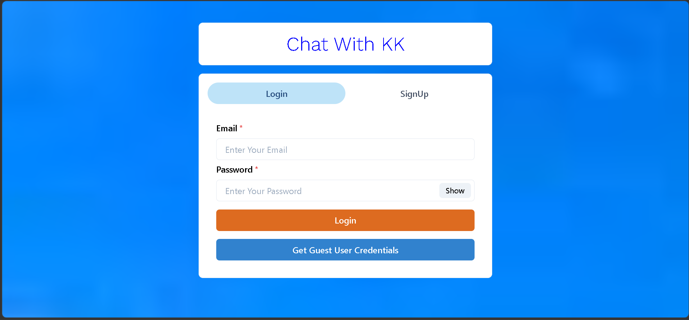
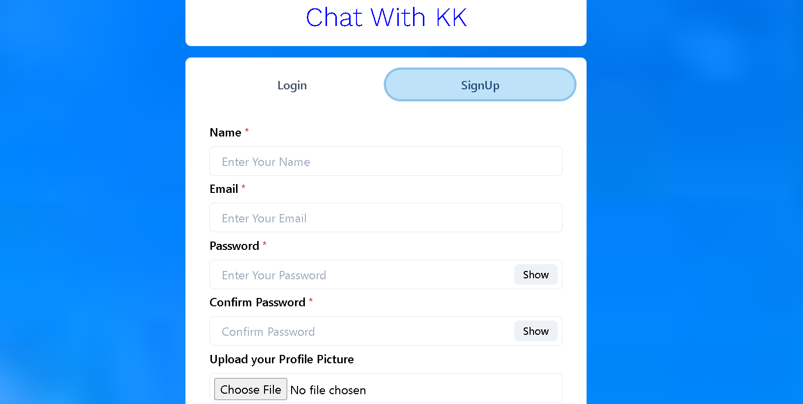
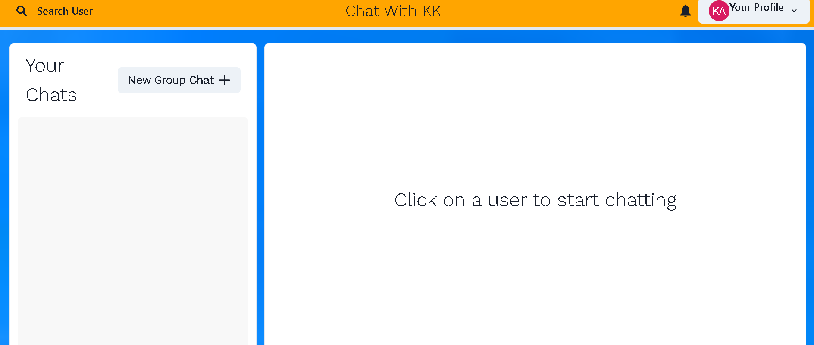
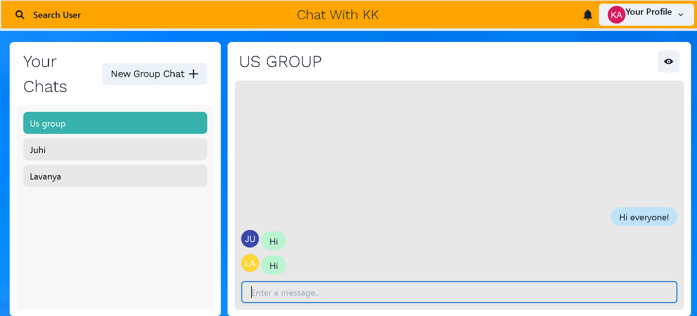
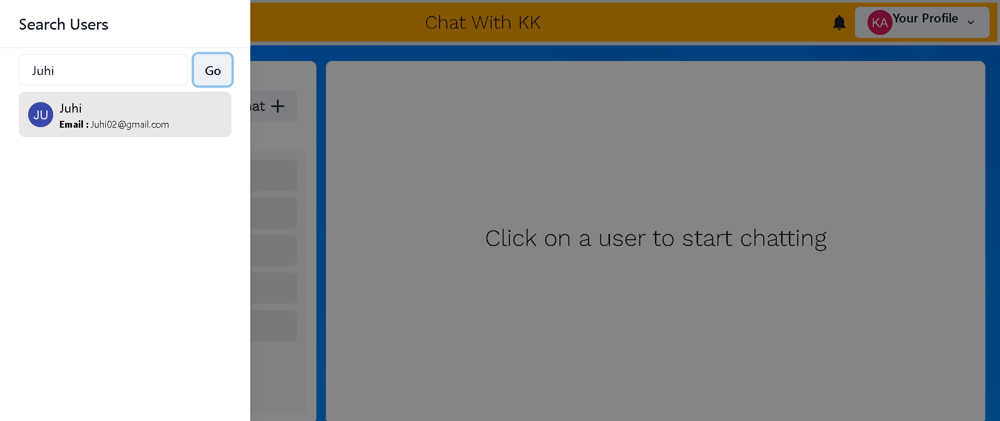
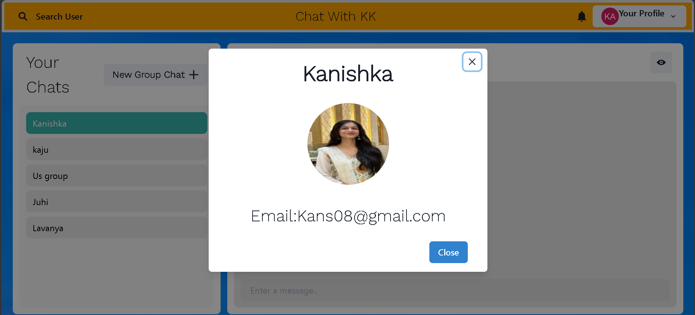

# 💬 Chat With KK

A full-stack real-time chat application built with the MERN stack and Socket.IO that enables users to communicate instantly through one-to-one and group conversations.

The application features secure JWT authentication, real-time messaging, typing indicators, user search, profile picture uploads, and complete group chat management in a responsive interface.

🌐 **Live Demo:** https://chat-with-kk.onrender.com

## ✨ Features

- 🔐 JWT Authentication (Login & Signup)
- 💬 One-to-One Chat
- 👥 Group Chat
- ⚡ Real-Time Messaging with Socket.IO
- ⌨️ Real-Time Typing Indicator
- 🔍 Search Users
- 📸 Profile Picture Upload (Cloudinary)
- ✏️ Rename Group Chats
- ➕ Add & Remove Group Members
- 🚪 Leave Group Chats
- 📱 Responsive UI built with Chakra UI
- ☁️ Deployed on Render

## 🛠️ Tech Stack

### Frontend

- React.js
- Chakra UI
- Axios
- Socket.IO Client
- React Router DOM

### Backend

- Node.js
- Express.js
- MongoDB
- Mongoose
- JWT Authentication
- Bcrypt.js
- Socket.IO

### Deployment & Services

- Render
- MongoDB Atlas
- Cloudinary

<h2>📸 Screenshots</h2>

<p align="center">
  
  
</p>

<p align="center">
  
  
</p>

<p align="center">
  
  
</p>

## 📂 Project Structure

```
ChatApp
├── backend
│   ├── config
│   ├── controller
│   ├── middlewares
│   ├── models
│   ├── routes
│   └── server.js
│
├── frontend
│   ├── public
│   ├── src
│   │   ├── components
│   │   ├── Context
│   │   ├── Pages
│   │   └── config
│   └── package.json
│
├── screenshots
├── package.json
└── README.md
```

## 🚀 Installation

### Clone the repository

```bash
git clone https://github.com/helloitskk/Chat_with_kk.git
```

### Navigate to the project

```bash
cd Chat_with_kk
```

### Install dependencies

```bash
npm install
npm install --prefix frontend
```

### Create a `.env` file

```env
PORT=5000
MONGO_URI=your_mongodb_connection_string
JWT_SECRET=your_secret_key
NODE_ENV=development
```

### Run the application

```bash
npm run dev
```

The frontend will run on:

```
http://localhost:3000
```

The backend will run on:

```
http://localhost:5000
```

## 🔑 Environment Variables

Create a `.env` file in the project root and add:

```env
PORT=
MONGO_URI=
JWT_SECRET=
NODE_ENV=
```

## 🚀 Demo

🔗 Live Application: https://chat-with-kk.onrender.com

**Demo Account**

Email: guest@new.com

Password: 123456

## 🚀 Future Improvements

- ✅ Message delivery status
- ✅ Read receipts
- ✅ Emoji picker
- ✅ File sharing
- ✅ Voice messages
- ✅ Video calling
- ✅ Dark Mode
- ✅ Push notifications
- ✅ Message reactions
- ✅ End-to-end encryption